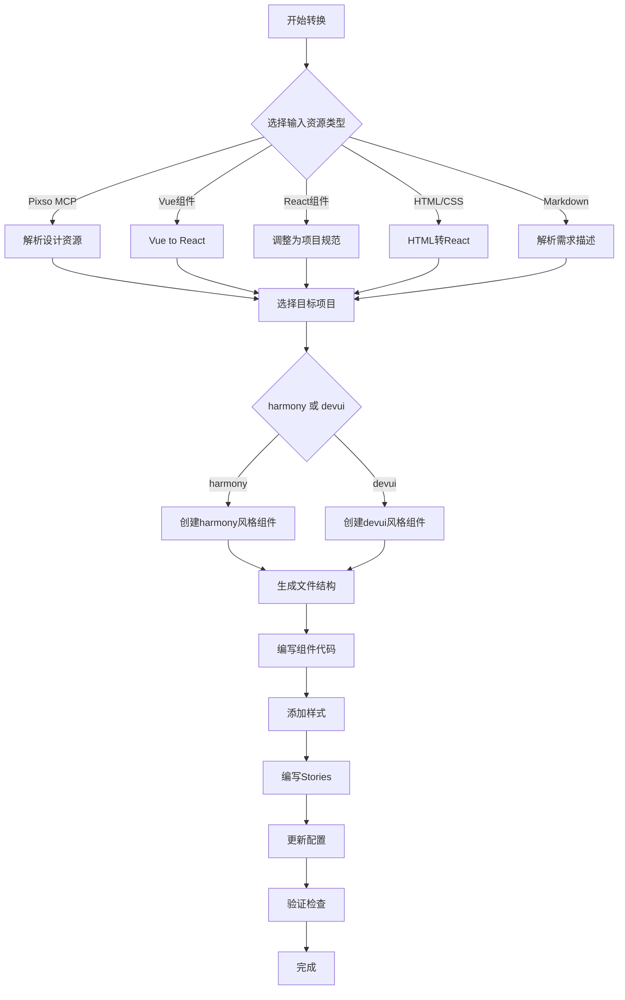

# AI辅助组件转换指南

本文档描述AI辅助组件转换的详细执行流程，供AI参考和执行。

## AI辅助组件转换流程总览

### 流程图



### 支持的输入资源

| 输入类型 | 说明 | 推荐AI技能 |
|----------|------|-----------|
| Pixso MCP | 从Pixso设计工具导出的组件 | component-converter |
| Vue组件 | .vue单文件组件 | vue-to-react-component |
| React组件 | 已有的React代码 | component-converter |
| HTML/CSS | HTML原型页面 | component-converter |
| Markdown | 用文字描述的组件需求 | component-converter |

---

## 新增组件详细流程

### 步骤1：准备工作

1. **明确组件需求**
   - 组件的功能是什么？
   - 需要哪些变体（样式、尺寸、状态）？
   - 有哪些交互行为？

2. **选择目标项目**
   - Harmony风格 → `harmony-ui-playground`
   - DevUI风格 → `devui-playground`

3. **准备输入资源**
   - 根据需求提供对应的输入文件或描述

### 步骤2：使用AI进行转换

#### 场景A：从Vue组件转换

使用 `vue-to-react-component` 技能：

**AI提示词模板：**

```
使用 vue-to-react-component 技能，将以下Vue组件转换为React组件：

[粘贴Vue组件代码]

要求：
- 目标项目：harmony-ui-playground（或devui-playground）
- 输出模式：多文件模式
- 组件位置：src/component/[ComponentName]/
- 需要生成Storybook stories
- 参考shadcn的button组件结构
```

**AI会自动处理：**
- Vue指令转换（v-if、v-for、v-model等）
- 生命周期钩子转换
- Props和Events转换
- 样式转换

#### 场景B：从其他资源转换

**AI提示词模板：**

```
帮我创建一个[组件名称]组件到harmony-ui-playground项目。

组件需求：(如果提供资源中有可以不描述)
[从你的输入资源中提取，例如]
- 类型：[描述组件类型]
- 变体：[列出需要的变体，如 primary/secondary, large/small等]
- 交互：[描述交互行为]
- 样式参考：[如果有参考图或CSS]

要求：
1. 按照项目规范创建文件结构
2. 使用CVA管理变体
3. 参考shadcn/button.tsx的结构
4. 添加完整的TypeScript类型定义
5. 创建Storybook stories
6. 更新导出文件
```

### 步骤3：创建组件文件结构

AI会创建以下文件：

```
src/component/ComponentName/
├── index.ts                    # 导出
├── ComponentName.tsx           # 组件
├── ComponentName.css           # 样式
└── ComponentName.stories.tsx   # Stories
```

### 步骤4：组件代码编写要点

#### TypeScript接口定义

```typescript
// 定义组件Props接口
export interface ComponentNameProps
  extends React.HTMLAttributes<HTMLDivElement> {  // 继承原生HTML属性
  variant?: "primary" | "secondary" | "tertiary"  // 变体
  size?: "small" | "medium" | "large"             // 尺寸
  disabled?: boolean                               // 状态
  // ... 其他props
}
```

#### CVA变体管理

```typescript
import { cva, type VariantProps } from "class-variance-authority"
import { cn } from "@/lib/utils"

const componentVariants = cva(
  // 基础样式
  "inline-flex items-center justify-center",
  {
    variants: {
      variant: {
        primary: "bg-primary text-primary-foreground",
        secondary: "bg-secondary text-secondary-foreground",
      },
      size: {
        small: "h-8 px-3 text-sm",
        medium: "h-10 px-4 text-base",
        large: "h-12 px-6 text-lg",
      },
    },
    defaultVariants: {
      variant: "primary",
      size: "medium",
    },
  }
)
```

#### 组件实现

```typescript
const ComponentName = React.forwardRef<HTMLDivElement, ComponentNameProps>(
  ({ className, variant, size, ...props }, ref) => {
    return (
      <div
        ref={ref}
        className={cn(componentVariants({ variant, size, className }))}
        {...props}
      />
    )
  }
)

ComponentName.displayName = "ComponentName"
export { ComponentName, componentVariants }
```

### 步骤5：样式文件

CSS文件使用CSS变量实现主题化：

```css
.my-component {
  --my-component-bg: var(--primary);
  --my-component-color: var(--primary-foreground);
  /* 其他样式 */
}
```

### 步骤6：Storybook Stories

```typescript
import type { Meta, StoryObj } from "@storybook/react-vite"
import { ComponentName } from "./ComponentName"

const meta = {
  title: "Components/ComponentName",
  component: ComponentName,
  tags: ["autodocs"],
  args: {
    variant: "primary",
    size: "medium",
  },
  argTypes: {
    variant: {
      control: "select",
      options: ["primary", "secondary", "tertiary"],
    },
    size: {
      control: "select",
      options: ["small", "medium", "large"],
    },
  },
} satisfies Meta<typeof ComponentName>

export default meta
type Story = StoryObj<typeof meta>

export const Playground: Story = {}

export const Variants: Story = {
  render: (args) => (
    <div className="flex gap-3">
      <ComponentName {...args} variant="primary">Primary</ComponentName>
      <ComponentName {...args} variant="secondary">Secondary</ComponentName>
    </div>
  ),
}

export const Sizes: Story = {
  render: (args) => (
    <div className="flex items-center gap-3">
      <ComponentName {...args} size="small">Small</ComponentName>
      <ComponentName {...args} size="medium">Medium</ComponentName>
      <ComponentName {...args} size="large">Large</ComponentName>
    </div>
  ),
}

export const States: Story = {
  render: (args) => (
    <div className="flex gap-3">
      <ComponentName {...args}>Default</ComponentName>
      <ComponentName {...args} disabled>Disabled</ComponentName>
    </div>
  ),
}
```

### 步骤7：更新项目配置

#### 对于harmony-ui-playground：

1. 更新 `src/component/index.ts`：
```typescript
export { ComponentName } from "./ComponentName"
```

2. 如果组件需要在blocks中使用，更新 `registry.json`：
```json
{
  "name": "@harmony",
  "blocks": [
    {
      "name": "block-name",
      "dependencies": ["component-name", ...]
    }
  ]
}
```

#### 对于devui-playground：

1. 更新 `src/components/ui/index.ts`（如果存在）或确保组件可以通过路径正确导入

---

3. **验证修改结果**

---

## 文件组织与命名规范

### 目录结构标准

#### harmony-ui-playground

```
harmony-ui-playground/
└── src/
    └── component/
        ├── Button/
        │   ├── index.ts
        │   ├── Button.tsx
        │   ├── Button.css
        │   └── Button.stories.tsx
        └── ComponentName/
            └── ...
```

#### devui-playground

```
devui-playground/
└── src/
    └── components/
        └── ui/
            ├── button/
            │   ├── index.ts
            │   ├── button.tsx
            │   ├── button.css
            │   └── button.stories.tsx
            └── component-name/
                └── ...
```

### 命名约定

| 类型 | 命名规则 | 示例 |
|------|----------|------|
| 组件名称 | PascalCase | `Button`, `TaskCard`, `StatusBar` |
| 组件文件 | 与组件名相同 | `Button.tsx`, `Button.css` |
| CSS类名 | kebab-case + 前缀 | `my-button`, `task-card` |
| 导出文件名 | index.ts | `index.ts` |
| stories文件 | 组件名 + .stories.tsx | `Button.stories.tsx` |

### CSS变量使用

使用项目定义的CSS变量，不要硬编码颜色：

```css
/* ✅ 正确 */
.my-button {
  background-color: var(--primary);
  color: var(--primary-foreground);
}

/* ❌ 错误 */
.my-button {
  background-color: #1890ff;
  color: #ffffff;
}
```

### 导出方式

```typescript
// index.ts - 默认导出
export { default as Button } from “./Button”
// 或者
export { Button } from “./Button”
export { Button, buttonVariants } from “./Button”
```

---

## 依赖管理

### 简单的依赖管理原则

1. **优先使用项目已有组件**
   - 在创建新组件前，先检查项目中是否已有类似组件
   - 可以复用已有组件，避免重复开发

2. **组件间的依赖**

   ```typescript
   // ✅ 正确 - 使用项目已有的组件
   import { Button } from “@/component/Button”
   import { Icon } from “@/component/Icon”

   export const MyComponent = () => {
     return (
       <div>
         <Button>Click me</Button>
         <Icon name=”check” />
       </div>
     )
   }

   // ❌ 错误 - 不要引入不存在的组件
   import { NonExistentComponent } from “somewhere”
   ```

3. **检查依赖是否可用**

   使用AI检查组件依赖是否存在于项目中：

   **AI提示词：**

   ```
   检查以下组件在harmony-ui-playground项目中是否存在：
   - Button
   - Icon
   - Switch

   请告诉我这些组件的导入路径。
   ```

4. **更新registry.json**

   当组件需要在blocks中使用时，确保在`registry.json`中声明依赖：

   ```json
   {
     “name”: “@harmony”,
     “blocks”: [
       {
         “name”: “my-block”,
         “dependencies”: [“button”, “icon”, “switch”]
       }
     ]
   }
   ```

---

## Icon处理

### 图标系统概述

两个项目都使用 **Lucide React** 图标库。

### 使用图标的方法

#### 1. 直接导入使用（临时）

```typescript
import { Check, X, Plus } from “lucide-react”

export const MyComponent = () => {
  return (
    <div>
      <Check className=”size-4” />
      <X className=”size-4” />
      <Plus className=”size-4” />
    </div>
  )
}
```

#### 2. 通过图标名称使用（需要适配层）

有些项目可能有图标名称到Lucide图标的映射。如果需要这种功能，可以让AI帮你创建一个图标适配层：

**AI提示词：**

```
创建一个Icon组件到harmony-ui-playground，支持通过名称使用Lucide图标：

使用示例：
<Icon name=”check” size={16} />
<Icon name=”x” size={20} />

要求：
1. 创建src/component/Icon/目录
2. 使用lucide-react作为图标源
3. 支持size属性设置图标大小
4. 支持className传递额外样式
```

### 图标大小规范

| 大小 | Tailwind类名 | 像素值 |
|------|-------------|--------|
| 特小 | size-3 | 12px |
| 小 | size-4 | 16px |
| 中 | size-5 | 20px |
| 大 | size-6 | 24px |

---

## 验收与检查清单

### 代码质量检查

- [ ] 组件文件结构完整（.tsx, .css, .stories.tsx, index.ts）
- [ ] TypeScript接口定义清晰
- [ ] 没有any类型（除非确实必要）
- [ ] Props有默认值

### 样式一致性检查

- [ ] 使用CSS变量而非硬编码颜色
- [ ] 遵循项目的命名规范
- [ ] 样式与设计规范一致

### Storybook检查

- [ ] Playground故事正常渲染
- [ ] 所有变体都有对应的故事
- [ ] 所有尺寸都有对应的故事
- [ ] 所有状态（正常、禁用等）都有展示

### 构建检查

在项目根目录运行：

```bash
# 1. 类型检查
npm run type-check  # 或 npx tsc --noEmit

# 2. 项目构建
npm run build

# 3. Storybook构建
npm run build-storybook
```

- [ ] 类型检查通过
- [ ] 项目构建成功
- [ ] Storybook构建成功

### 导出检查

- [ ] index.ts正确导出组件
- [ ] 可以通过正确路径导入组件
- [ ] 如果组件在blocks中使用，registry.json已更新
